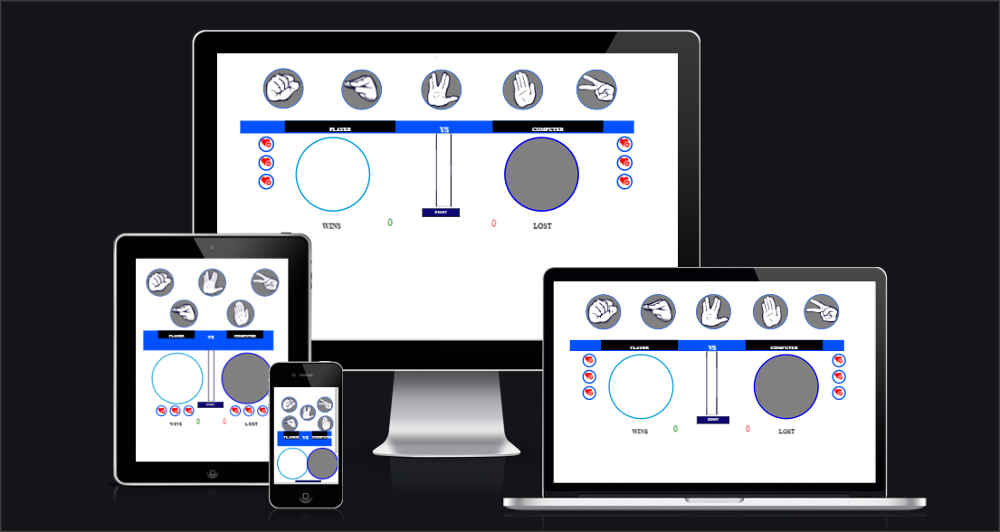
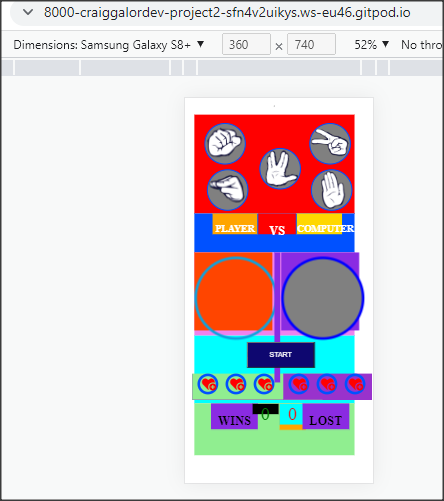
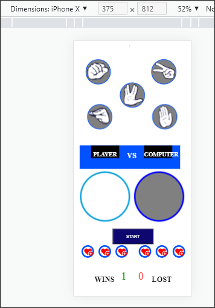
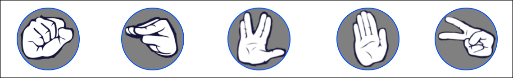
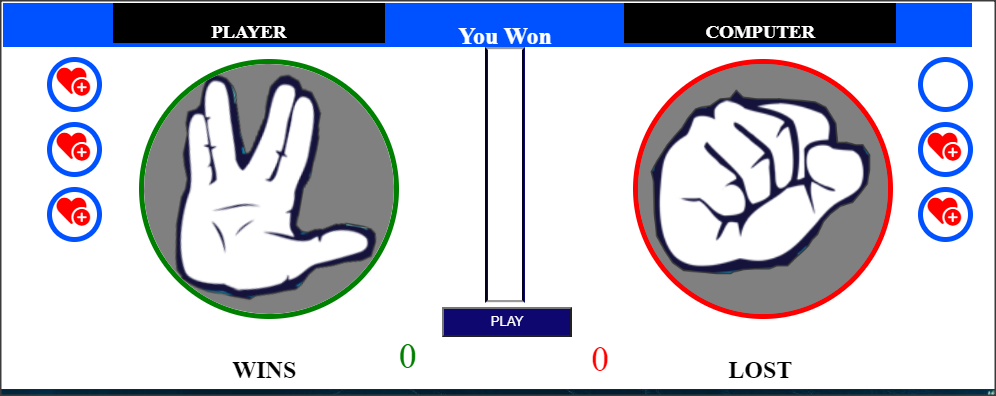
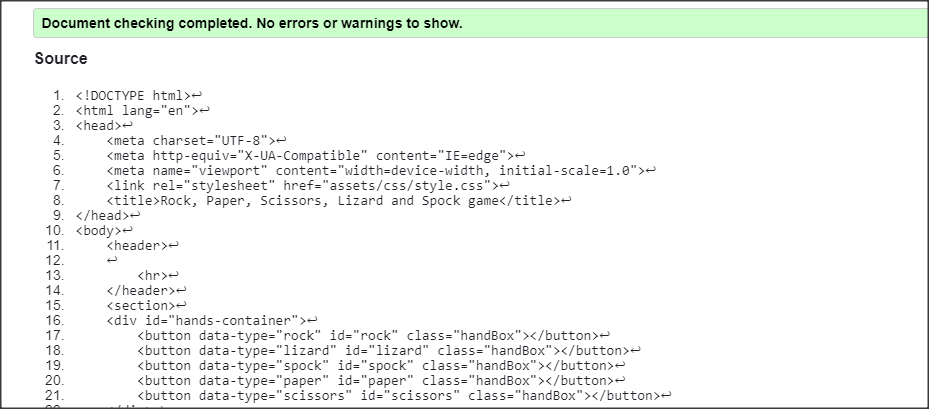
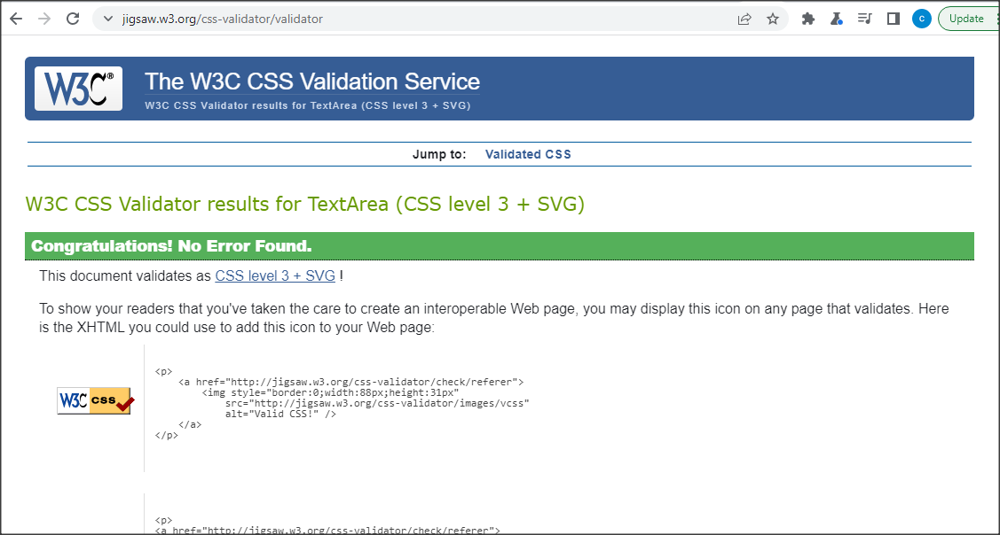
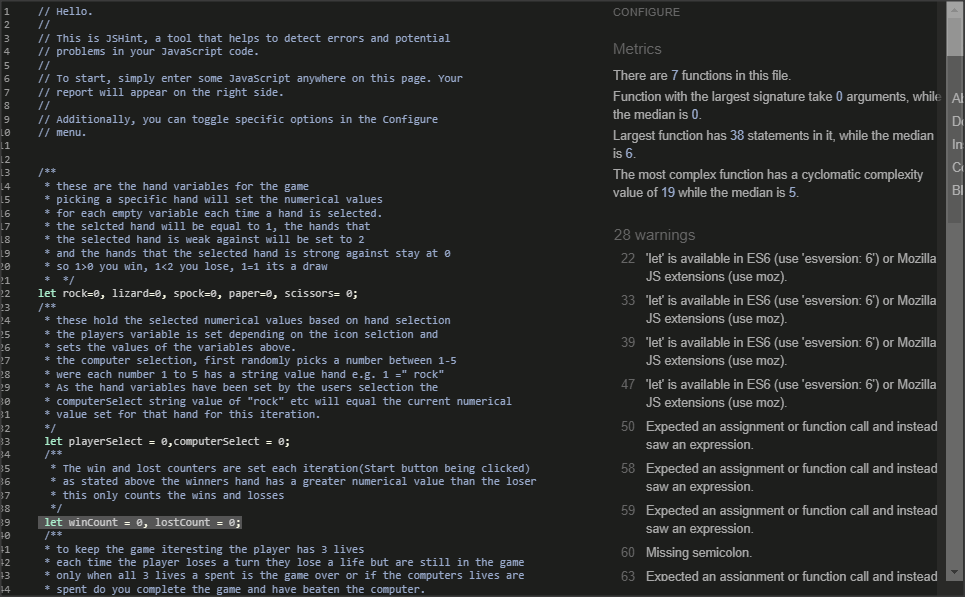

# Rock Paper Scissors,Lizard #
Rock, lizard, spock an addaptation of the traditional rock paper scissors game with two extra hand signs to play with increasing the unpredictable odds of this classic past time.
  
For those who enjoy making tricky decisions this helps instead of fliping a coin or if you  just like a little challenge now and then, the games out come is the most enjoyable part. 

## Response Mockup ##
 

# Features #
* hand selection
* life counter
* game counter
* outcome circle colour
* people who like to play traditional rock paper scissors game with extra hands. 

## Existing Features ##
The hand selection Heading

At the top of the page there are the various hands shapes featured that the user can select to play against the computer. This section requires the user to make a selection to play the game. The user will be able to easily see the icons for rock, lizard, spock, paper and scissors games.
The user will be able to select the type of hand they will be playing with by clicking on the different icons this also starts the computers random selection behind the scenes.

## The Game Area ##

The Game Area is where the user will be able to see the hand shape they have choosen to play with, along with the start button to start playing the game. The user and computer will also have three life icons displayed on each side ,when all lives are lost by either party the game is over.

## The Score Area ##

This section will allow the user to see exactly how many completed game outcomes were won or lost to the computer

## Testing ##
the basic operation of the game works, selction alert were the user needs to pick a hand to
start the game, the computers random selection, the outcome indicators

## Validator Testing ##

* **HTML**

some errors were returned when passing through the official W3C validator
You cannot place divs inside button elements lesson learned.
taking out the div labels everything came back all clear.

* **CSS**

No errors were found when passing through the official (Jigsaw) validator

* **JavaScript** 

Suggestions were found when passing through the official Jshint validator
The following metrics were returned:
CONFIGURE
## Metrics ##
* There are 7 functions in this file.

* Function with the largest signature take 0 arguments, while the median is 0.

* Largest function has 38 statements in it, while the median is 6.

* The most complex function has a cyclomatic complexity value of 19 while the median is 5.

## Deployment ##
The site was deployed to GitHub pages. The steps to deploy are as follows:
In the GitHub repository, navigate to the Settings tab
From the source section drop-down menu, select the Master Branch
Once the master branch has been selected, the page will be automatically refreshed with a detailed ribbon display to indicate the successful deployment.
The live link can be found here - https://craiggalordev.github.io/project2/

## Credits ##
the image used for the hand icons
https://static.wixstatic.com/media/903056_39aa9523c70a428684be9744580b0b1b~mv2.png/v1/fit/w_1000%2Ch_1000%2Cal_c/file.png
